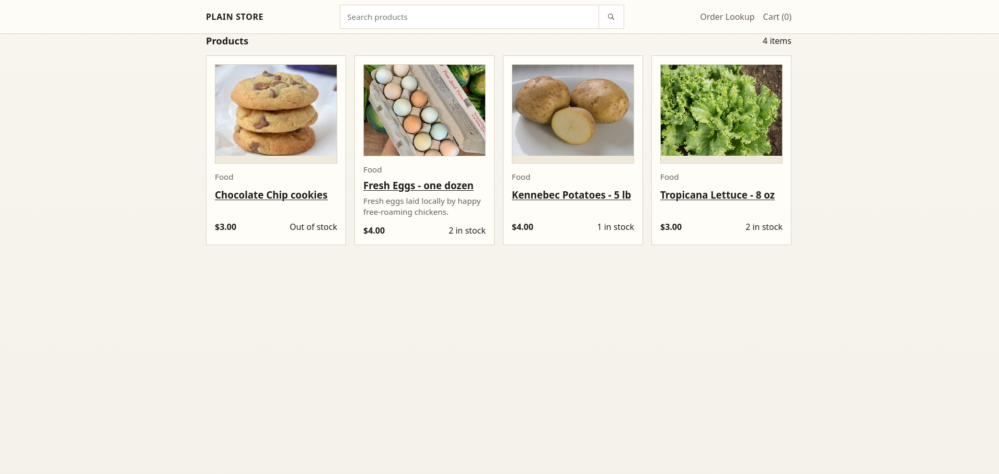

# Plain Store

Minimalist, self-hosted local pickup store MVP built as a small Node.js monolith.



## Stack

- Node.js
- Express
- SQLite via the built-in `node:sqlite` module
- Server-rendered HTML from plain template functions
- Static CSS and local SVG product images

## Run

1. Install dependencies:

   ```bash
   npm install
   ```

2. Review `.env` and adjust it for your machine.

   Local development now reads configuration from [`.env`](/home/korgan/store/.env) automatically.

3. Start the server:

   ```bash
   npm start
   ```

4. Open `http://localhost:3001`

The first run creates `data/store.db` and seeds a small demo catalog automatically.

## Routes

- `/` catalog homepage
- `/search?q=...` simple search
- `/c/:slug` category pages
- `/p/:slug` product detail pages
- `/cart` basket
- `/checkout` pickup details
- `/order/:orderNumber` pickup order confirmation
- `/order-lookup` pickup order lookup
- `/admin` admin dashboard

## Admin

The admin is intentionally plain. It supports:

- product create/edit
- inventory and pricing updates
- category creation
- order status updates

Default local password fallback is `change-me`. Set `ADMIN_PASSWORD` in real use.

## Operations

- Data lives in `data/store.db`
- Email uses SMTP when `SMTP_HOST` and `MAIL_FROM` are set
- Without SMTP settings, email messages are written to `data/email_outbox/`
- Static assets live in `public/`
- Simple file backups: `npm run backup`
- Health check: `/healthz`
- Put Caddy or Nginx in front for TLS and compression
- A minimal [Caddyfile](/home/korgan/store/Caddyfile) is included for self-hosting

## systemd

A ready-to-install unit file is included at [systemd/plain-store.service](/home/korgan/store/systemd/plain-store.service).

Install and enable it with:

```bash
sudo cp /home/korgan/store/systemd/plain-store.service /etc/systemd/system/plain-store.service
sudo systemctl daemon-reload
sudo systemctl enable --now plain-store
```

Useful commands:

```bash
sudo systemctl status plain-store
sudo journalctl -u plain-store -f
sudo systemctl restart plain-store
```

## Environment

- `PORT` defaults to `3001`
- `ADMIN_PASSWORD` should always be set in real use
- `COOKIE_SECRET` should always be set in real use
- `COOKIE_SECURE=true` is recommended behind HTTPS; use `false` for plain local HTTP development
- `PUBLIC_STORE_URL` is used in order-status email links
- `MAIL_FROM`, `STORE_OWNER_EMAIL`, and `SMTP_*` enable real email delivery
- `.env` values are loaded automatically by the npm scripts

## Notes

- Local pickup only
- Pay at pickup; no online payment flow
- Pickup lifecycle decision flow: [docs/pay-at-pickup-flow.md](/home/korgan/store/docs/pay-at-pickup-flow.md)
- No shipping
- No customer accounts by default
- No third-party tracking
- No SPA or frontend build pipeline
- No external services required for the MVP
