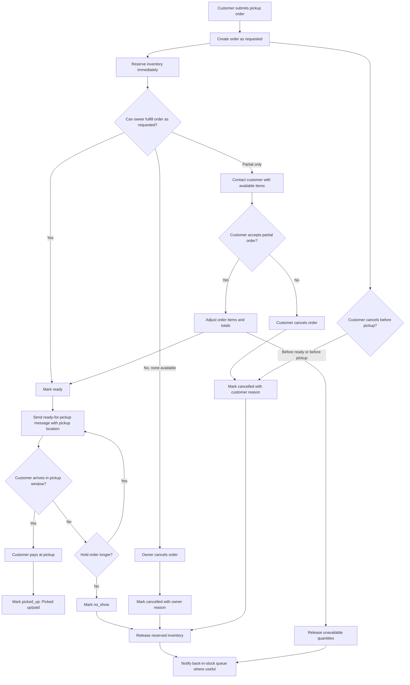

# Pay-at-Pickup Decision Flow

This store should remain pickup-order software first. Customers reserve local
inventory, the owner confirms and prepares the order, and payment happens at
pickup. No online payment is captured in this flow.

## Status Model

Keep the customer-facing statuses small:

- `requested`: customer submitted a pickup request and inventory is reserved.
- `ready`: owner confirmed the order and marked it ready for pickup.
- `picked_up`: customer picked up the order and paid. Admin label: "Picked up/paid".
- `cancelled`: order will not be fulfilled. Use a reason to distinguish customer cancellation, owner cancellation, or partial-cancellation cases.
- `no_show`: customer missed the pickup window and the owner decided not to keep holding the reservation.

Treat returned-to-stock as an inventory event, not a separate order status. A
cancelled or no-show order may release all reserved items, and a partially
fulfilled order may release only the unfilled quantities.

## Main Flowchart

## Admin Decisions

1. New order arrives as `requested`.
2. Owner checks stock, quality, and pickup notes.
3. If the order can be filled, mark it `ready`.
4. If the order cannot be filled, cancel it with an owner reason and release inventory.
5. If only part can be filled, contact the customer before marking ready.
6. If the customer accepts partial fulfillment, adjust the order, release the unavailable quantities, then mark the remaining order `ready`.
7. If the customer cancels, mark `cancelled` with a customer reason and release inventory.
8. If the customer misses pickup, choose whether to hold it longer or mark `no_show`.
9. When cancelled or no-show inventory is released, notify the back-in-stock queue in request order.
10. When the customer picks up and pays, mark `picked_up`.
11. Archive completed, cancelled, or no-show orders when they no longer need to stay on the active board.

## Inventory Rules

- Order submission reserves stock by decrementing product inventory immediately.
- `ready` does not change inventory because the reservation already exists.
- `picked_up` does not change inventory because the reservation became a sale.
- `cancelled` releases reserved quantities back to product inventory unless the owner marks items as spoiled, discarded, or otherwise unavailable.
- `no_show` releases reserved quantities only when the owner decides to stop holding the order.
- Partial fulfillment releases only the quantities that will not be picked up.
- Returned-to-stock is tracked on the order with `inventory_released_at` so the same order cannot restore stock twice.

## Back-in-Stock Queue

Keep this accountless and low-commitment:

- Customers opt in from an unavailable product page.
- Store contact should be email first, with optional SMS only after explicit text opt-in.
- Queue order is based on request time per product.
- A notification does not guarantee availability; it tells the customer the item may be available again.
- When stock increases or a reservation falls through, notify the oldest unnotified requests for that product.
- Do not expose queue position publicly.
- Do not require a customer account to join or leave the queue.

## Account Decision

Use a hybrid accountless model for now:

- Keep checkout accountless.
- Remember repeat customers with a local cookie that can prefill name, email, phone, and pickup notes on the same device.
- Let customers look up orders by order number plus email.
- Add optional email or phone verification later only if repeat-order friction becomes a real problem.
- Do not add passwords, mandatory accounts, or a full customer portal yet.

Optional lightweight accounts can be reconsidered when the store needs saved
pickup preferences across devices, customer-managed notification queues, or a
cleaner repeat-order history. Until then, the support and privacy burden is not
worth it.

## Implementation Notes

The next workflow implementation should add the smallest missing pieces first:

- A status-change history table or notes field so reason and release decisions are visible.
- Partial fulfillment adjustment in admin before marking an order ready.
- Clearer pickup-location text in confirmation and ready-for-pickup emails.
